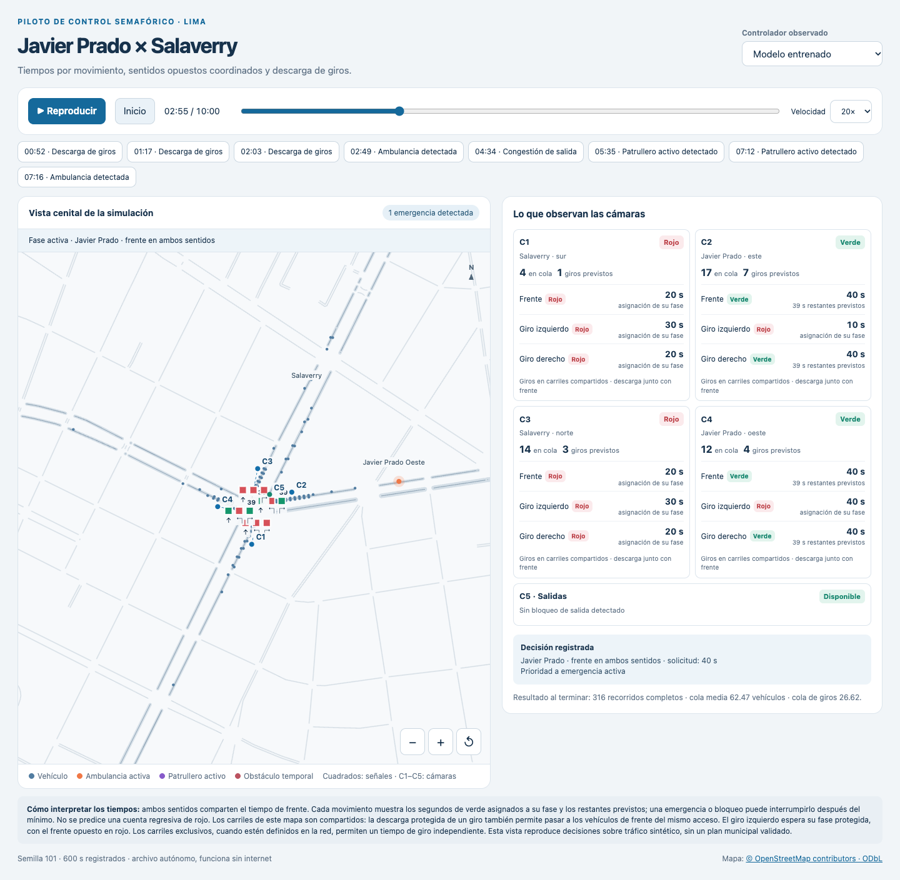

# Agilizador: Q-learning para tráfico en Javier Prado/Salaverry

Proyecto de control semafórico con aprendizaje automático para Javier Prado

Primer experimento de aprendizaje de **duraciones de verde** para un cruce de Lima,
con cinco cámaras virtuales y cuadras adyacentes. Se usa una red descargada de
OpenStreetMap y tráfico generado en SUMO. **Todos los flujos, emergencias y bloqueos
son sintéticos; el modelo no está calibrado ni validado para operar semáforos reales.**

## Qué contiene

- `archivo.ipynb`: cuaderno para revisar el mapa, los supuestos y los resultados.
- `outputs/mapa_camaras.png` y `.svg`: mapa y detalle de las cinco cámaras.
- `data/pilot.net.xml`: red SUMO; conserva calles y semáforos vecinos como contexto.
- `data/cameras.json`: posición propuesta, carriles cubiertos y señales observadas.
- `outputs/demo/`: escenario de diez minutos, observaciones y decisiones.
- `outputs/model.json`: Q-learning inicial; acciones de 10 a 60 segundos de verde, en pasos de 10.
- `outputs/evaluation.json`: comparación con semillas reservadas para evaluación.
- `outputs/vista_camaras.png`: muestra cenital con señales y observaciones de las cámaras.
- `requirements-lock.txt`: versiones exactas del entorno usado para este experimento.
- `outputs/simulacion.html`: visor autónomo con reproducción y comparación de controladores.

## Revisar la simulación visual



Abre `outputs/simulacion.html` en Chrome, Safari u otro navegador. El archivo contiene
todos sus datos y funciona sin servidor ni conexión a internet. Permite reproducir,
pausar, cambiar la velocidad, recorrer el tiempo y saltar a emergencias o congestión.
El selector cambia entre el modelo entrenado y el controlador por reglas, con la
misma demanda y semilla. Las señales y las posiciones vienen de los registros SUMO;
la animación interpola posiciones entre muestras de un segundo.

El visor muestra una reproducción de decisiones ya tomadas. Cambiar de controlador
carga otra grabación; los botones no modifican el tráfico ni entrenan el modelo.
C1–C4 muestran una señal por movimiento: frente, giro izquierdo y giro derecho.
Cada fila indica el verde asignado a su fase y los segundos restantes previstos en
el verde activo. Una emergencia o bloqueo puede adelantar su fin después del mínimo;
no se inventa una cuenta regresiva de rojo. C5 indica las fases restringidas por
salidas congestionadas. El visor usa la semilla 101, reservada para evaluación.
El botón **Descarga de giros** permite revisar una respuesta a una cola acumulada.

El frente de C2 y C4 comparte fase y tiempo en Javier Prado; el de C1 y C3 comparte
fase y tiempo en Salaverry. El mapa actual infiere carriles compartidos: una fase
de descarga de giro permite avanzar también a los vehículos de frente del mismo
acceso, con el sentido opuesto en rojo. Los giros izquierdos esperan esa descarga
protegida; no se habilitan al mismo tiempo que el frente opuesto. Si una red define
carriles exclusivos de giro, el controlador genera fases y tiempos independientes
para ellos. La existencia física de esos carriles debe confirmarse en campo.

Para regenerarlo tras modificar el modelo o el escenario:

```bash
.venv/bin/python -m pilot.cli visual --seconds 600 --seed 101
```

Las grabaciones se guardan en `outputs/visual/`. El cuaderno ofrece también un visor
con control de tiempo, si se prefiere trabajar dentro de Jupyter.

Al descargar el repositorio, abre el visor desde tu copia local. GitHub muestra el
HTML como código; para verlo funcionando, descarga el proyecto con **Code →
Download ZIP** o clónalo. Se incluyen el visor, el modelo, los resultados resumidos
y una demostración completa. Las grabaciones adicionales de evaluación y los
archivos temporales se regeneran con los comandos del proyecto.

## Cámaras

| Cámara | Cobertura ideal |
| --- | --- |
| C1 | Acceso sur de Salaverry: carriles, giros y semáforos. |
| C2 | Acceso este de Javier Prado: carriles, giros y semáforos. |
| C3 | Acceso norte de Salaverry: carriles, giros y semáforos. |
| C4 | Acceso oeste de Javier Prado: carriles, giros y semáforos. |
| C5 | Calles receptoras y señales del cruce. |

Las cámaras son **sensores ideales por carriles**: no generan imágenes ni simulan
perspectiva, oclusiones o errores de visión. C1–C4 observan hasta 240 m antes del
cruce y C5 hasta 150 m después. No se confirma que una cámara física en C5 pueda
cubrir todas las salidas: la ubicación y la cobertura requieren un estudio de campo.
Ver los semáforos permite observar su estado; para accionarlos en el mundo real
también haría falta una interfaz autorizada con el controlador semafórico.

## Modelo y reglas

El Q-learning tabular aprende una duración de verde según la fase elegida,
la cola de sus movimientos, la cola total visible, la cola de giro, la espera
y la presencia de una emergencia activa. Los giros se conocen por las rutas
sintéticas; una cámara real necesitaría estimarlos con seguimiento y calibración.

Las reglas eligen la siguiente fase según demanda y espera por movimiento. Una
cola de giro de al menos tres vehículos con 20 s de espera activa la preferencia
por una descarga protegida. El controlador por reglas aumenta el tiempo según la
cola del acceso más cargado de la fase, hasta 60 s. El modelo aprende la duración
con una recompensa que penaliza adicionalmente la cola de giro. La fase también
depende de la prioridad de emergencia y de si las salidas están disponibles.
El detector distingue explícitamente `police_idle` de `police_active`.
Las emergencias respetan el rojo en este experimento; no se activa el dispositivo
SUMO que permite ignorarlo. Emergencias con recorridos compatibles pueden compartir
una fase; recorridos incompatibles se atienden en fases sucesivas.

Las dos fases normales coordinan los sentidos opuestos de cada avenida. En esta
red hay además cuatro fases de descarga, una por acceso con giros compartidos.
El frente del acceso atendido comparte el tiempo de descarga cuando no hay carril
exclusivo. Los movimientos prioritarios de accesos diferentes se comprueban contra
la matriz de conflictos de SUMO. Es un plan experimental, **no el plan semafórico municipal**. Se
respetan un verde mínimo de 10 s, máximo continuo de 60 s, amarillo calculado por
SUMO, al menos 2 s de todo rojo y despeje del área interna antes del siguiente verde.
Esos valores son parámetros experimentales y no tiempos aprobados para esta vía.
Los 120 s de espera activan una preferencia de servicio; no garantizan un máximo
de espera cuando hay salidas bloqueadas o emergencias concurrentes.

Una salida se considera congestionada si sus primeros 60 m están al menos al 75 %
de su capacidad estimada y tienen dos o más vehículos detenidos, o si una cola de
al menos dos vehículos en un carril llega a 15 m de su entrada. Se evita habilitar un acceso que
envíe vehículos hacia esa salida; si todas están bloqueadas se mantiene todo rojo.
Se cierra el movimiento hacia la salida bloqueada; un giro bloqueado no cierra
automáticamente el frente si éste tiene otra salida libre. Si una salida de frente
está bloqueada, se restringe la fase normal de ambos sentidos para mantener su
coordinación. SUMO aplica además su regla de no bloquear
el cruce. La recompensa penaliza colas visibles, detención de emergencias y salidas
congestionadas. Cada actualización usa el descuento correspondiente al tiempo real
de la acción, que puede interrumpirse después del verde mínimo.

## Ejecutar

Python 3.11 o superior. SUMO 1.27.1 tiene paquete para macOS ARM64, Linux y Windows;
en otras plataformas hay que instalar los binarios de SUMO por separado.

```bash
python3 -m venv .venv
.venv/bin/python -m pip install -r requirements.txt
.venv/bin/python scripts/build_network.py
.venv/bin/python -m pilot.cli map
.venv/bin/python -m pilot.cli demo --seconds 600
.venv/bin/python -m pilot.cli train --episodes 25 --seconds 600 --seed 7
.venv/bin/python -m pilot.cli evaluate --seconds 600 --seeds 101,102,103
.venv/bin/python -m unittest discover -s tests -v
```

Python y SUMO se comunican mediante un puerto local. En Windows, usa
`.venv\Scripts\python.exe` en lugar de `.venv/bin/python`. En Jupyter, selecciona
el intérprete `.venv/bin/python` o ejecuta los comandos de arriba desde el cuaderno.
Reejecutar un comando reemplaza los resultados de ese experimento.

La evaluación usa la misma demanda y semilla SUMO para los tres controladores:
duración fija de 20 s, duración por reglas según cola y duración aprendida. **Los tres
comparten las reglas de prioridad, despeje y congestión**, para comparar el efecto
del aprendizaje de tiempos. Esta referencia de duración fija no reproduce un plan
municipal ni un ciclo fijo puro. Las semillas de evaluación no pueden coincidir con
las de entrenamiento. Se informa quién sigue dentro de la red o pendiente de entrar
al terminar; las métricas incluyen esperas parciales de esos vehículos.

## Datos geográficos y límites

Se conserva el extracto original en `data/javier_prado_salaverry.osm`, obtenido el
4 de octubre de 2026 del API público de OSM, con límites
`(-77.0595, -12.0995, -77.0490, -12.0898)` (oeste, sur, este, norte).
El centro aproximado es `(-12.0951777, -77.0543726)` (latitud, longitud).
La zona consultada mide aproximadamente 1.1 km por lado; la cobertura observable
del controlador es menor y se define en `cameras.json`. Los límites de SUMO conservan
aristas que intersectan el rectángulo, por lo que algunos extremos pueden quedar fuera.

Fuente: [© OpenStreetMap contributors](https://www.openstreetmap.org/copyright),
licencia ODbL 1.0. Para actualizar el extracto:

```bash
curl --fail --location 'https://www.openstreetmap.org/api/0.6/map?bbox=-77.0595,-12.0995,-77.0490,-12.0898' --output data/javier_prado_salaverry.osm
```

Las seis referencias OSM del cruce se unen mediante `data/join.nod.xml` para eliminar
segmentos artificiales dentro de la intersección. Carriles, giros, restricciones y
otros planes semafóricos requieren revisión; los avisos de importación quedan en
`data/network_build.log`. En particular, no se ha verificado la existencia física
de carriles exclusivos de giro; se modelan conexiones y carriles compartidos inferidos.
Los semáforos vecinos siguen sus planes sintéticos; sólo el cruce principal aprende.
Cambiar fases o acciones invalida el modelo anterior: su firma se comprueba al cargar
el archivo y hay que reentrenar antes de evaluar o generar el visor.
Todavía faltan peatones, ciclistas, buses y paraderos calibrados, geometría de cámaras,
percepción por video y conteos reales de llegadas y giros.

El entrenamiento breve prueba que la cadena funciona. Un resultado mejor o peor
en estas semillas no demuestra rendimiento fuera de la simulación. Antes de ampliar
el modelo se necesitan aforos locales, revisar los planes reales y evaluar demanda
no vista, fallos de cámaras, emergencias mal detectadas y acumulación en los bordes.

## Resultado con fases coordinadas y descarga de giros

Se reentrenaron 25 episodios de 600 s (semillas 7–31), con 711 actualizaciones y
93 estados registrados. La evaluación usó semillas 101, 102 y 103:

| Controlador | Cola media visible (vehículos) | Cola media de giros | Recorridos completos medios |
| --- | ---: | ---: | ---: |
| Duración fija de 20 s con las reglas comunes | 47.98 | 19.76 | 305.0 |
| Duración según cola con las reglas comunes | 57.42 | 23.74 | 301.7 |
| Duración aprendida con las reglas comunes | 52.49 | 21.65 | 301.3 |

**El modelo mejora las colas frente al tiempo por reglas, pero no supera los 20 s
fijos en estas tres semillas.** La descarga de giros está implementada y comprobada;
no se ha demostrado que sus tiempos sean óptimos. Conviene mejorar la representación
del estado, la recompensa y el entrenamiento antes de sostener que el aprendizaje
ofrece una ventaja. Los tres escenarios son una comprobación inicial, no una
evaluación estadística concluyente. La demostración, los 25 episodios de entrenamiento
y las nueve ejecuciones de evaluación registraron cero vehículos con colisión.

La demostración registró 56 muestras de un segundo con congestión de salida y 60
muestras de descarga por cuello de botella de giro. Se comprobaron 210 muestras
de verde de frente con tiempos iguales para los dos sentidos. El
archivo `outputs/verification.json` contiene la revisión de sus fases y duraciones.
Trece pruebas comprueban cobertura, prioridad, bloqueos, máximo verde, reproducción
de escenarios, tiempos compartidos, carriles exclusivos y tratamiento del final del
episodio. El cuaderno incluye los resultados
y un visor de tiempo; vuelve a ejecutar su celda para activar el control interactivo.

Documentación: [importar OSM en SUMO](https://sumo.dlr.de/docs/Networks/Import/OpenStreetMap.html),
[fases semafóricas](https://sumo.dlr.de/docs/Simulation/Traffic_Lights.html),
[vehículos de emergencia](https://sumo.dlr.de/docs/Simulation/Emergency.html).
